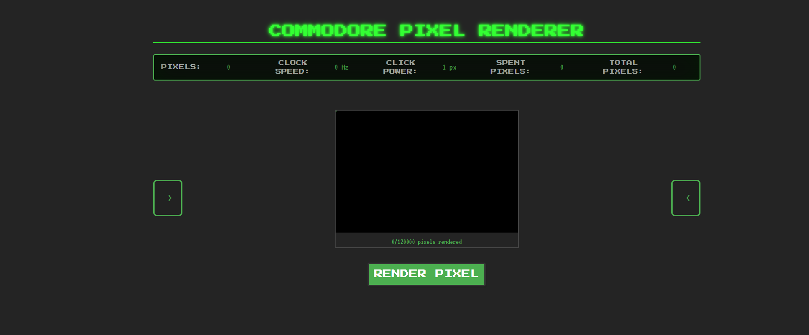

# Commodore Pixel Renderer

A retro-style incremental game inspired by the Commodore computers of the 1980s. Render pixels, upgrade your system, and unlock new capabilities in this nostalgic clicker game.

## [Changelog](CHANGELOG.md)

## Features

- Pixel rendering with retro CRT effects
- Multiple upgrade paths (CPU speed, multipliers, click power)
- 'Authentic' retro Commodore aesthetics
- Optimized for large numbers with Decimal.js
- (hopefully) Fully responsive design

## Screenshots



## Getting Started

### Prerequisites

- Node.js (v14.0.0 or higher)
- npm or yarn

### Installation

1. Clone the repository

    ```bash
    git clone https://github.com/D-Heger/CommodoreClickerClone.git
    cd Commodore-Pixel-Renderer
    ```

2. Install dependencies

    ```bash
    npm install
    # or
    yarn
    ```

3. Start the development server

    ```bash
    npm run dev
    # or
    yarn dev
    ```

## Project Structure

- `src/assets` - Game assets and configuration
- `src/components/game` - Game UI components
- `src/utils` - Utility functions and game logic

## Built With

- [Vue 3](https://vuejs.org/) - The web framework used
- [Vite](https://vitejs.dev/) - Build tool and development server
- [Decimal.js](https://mikemcl.github.io/decimal.js/) - Library for arbitrary-precision decimal arithmetic

## License

This project is licensed under the MIT License - see the [LICENSE](LICENSE) file for details.

## Acknowledgments

- Inspired by the Commodore 64 and other classic computers
- Special thanks to the maker of [C64Clicker](http://c64clicker.com/) for the initial idea
